# Contributing to Nest

Thank you for considering contributing to the **OWASP Nest** project! This document provides guidelines to help you get started.

## About the Project

Nest is a full-stack web application built using:

- **Backend**: Python, Django
- **Frontend**: TypeScript, Next.js, React, Tailwind CSS
- **Search**: Algolia

The project uses a **containerized approach** for both development and production environments. Docker is required to run Nest locally.

## Prerequisites

Before contributing, ensure you have the following installed:

1. **Docker**: Required for running the Nest instance - [Docker Documentation](https://docs.docker.com/).
1. **pre-commit**: Required to automate code checks and apply fixes, ensuring consistent and high-quality code. Install it using virtual environment with `pip install pre-commit` command, as OS package with `apt install pre-commit` / `brew install pre-commit` or any other method depending on your configuration.

1. **WSL (Windows Subsystem for Linux)**: Required for Windows users to enable Linux compatibility - [WSL Documentation](https://docs.microsoft.com/en-us/windows/wsl/).
   1. The `make run` command requires WSL to function properly. Make sure WSL is installed and configured on your system.
      If you haven't installed WSL yet, follow [Microsoft's official guide](https://learn.microsoft.com/en-us/windows/wsl/install).
   1. You must use WSL terminal (not Windows PowerShell) otherwise there is no guarantee that Nest development environment will be set up as intended. Please do not report any issues if you use PowerShell for running the commands -- it's not the intended way to run Nest locally so the errors will not be accepted as bugs.
   1. Ensure WSL integration is enabled in Docker Desktop settings by checking `Resources -- WSL integration` in Docker application settings.

## Starring the Project

[](https://github.com/OWASP/Nest)

## Forking the Repository

[](https://github.com/OWASP/Nest/fork)

## Environment Variables

### Frontend

#### `NEXT_PUBLIC_API_URL`

- **Description**: The base URL for the application's internal API.
- **Example Value**: `https://nest.owasp.org/`
- **Usage**: Used by frontend components to make API calls.

#### `NEXT_PUBLIC_CSRF_URL`

- **Description**: The endpoint used to fetch CSRF tokens for secure API requests.
- **Example Value**: `https://nest.owasp.org/csrf/`
- **Usage**: Required for protecting POST/PUT/DELETE requests from CSRF attacks.

#### `NEXT_PUBLIC_ENVIRONMENT`

- **Description**: Specifies the current environment in which the application is running.
- **Example Value**: `production`
- **Usage**: Used for toggling features or logging based on environment (`development`, `production`, etc).

#### `NEXT_PUBLIC_GRAPHQL_URL`

- **Description**: The endpoint for the GraphQL API.
- **Example Value**: `https://nest.owasp.org/graphql/`
- **Usage**: Used to send GraphQL queries and mutations from the frontend.

#### `NEXT_PUBLIC_GTM_AUTH`

- **Description**: Authentication token for Google Tag Manager (GTM).
- **Example Value**: `XYZabc123`
- **Usage**: Optional; used when previewing or testing GTM in different environments.

#### `NEXT_PUBLIC_GTM_ID`

- **Description**: The unique ID for the Google Tag Manager container.
- **Example Value**: `GTM-XXXXXXX`
- **Usage**: Required for integrating Google Tag Manager on the frontend.

#### `NEXT_PUBLIC_GTM_PREVIEW`

- **Description**: Used for previewing GTM configurations.
- **Usage**: Optional, used during GTM debugging or testing.

#### `NEXT_PUBLIC_IDX_URL`

- **Description**: The base URL for IDX (Indexing Service).
- **Example Value**: `https://nest.owasp.org/idx/`
- **Usage**: Used for services interacting with indexing/search features.

#### `NEXT_PUBLIC_RELEASE_VERSION`

- **Description**: The current release version of the application.
- **Example Value**: `1.0.5`
- **Usage**: Displayed in the app UI or logs for tracking deployments.

#### `NEXT_PUBLIC_SENTRY_DSN`

- **Description**: The Data Source Name (DSN) for Sentry error tracking.
- **Example Value**: `https://xyz@sentry.io/123456`
- **Usage**: Enables real-time error tracking and reporting in the frontend.

---

### Backend

#### `DJANGO_ALGOLIA_APPLICATION_ID`

- **Description**: The application ID for Algolia.
- **Example Value**: `APPID123`
- **Usage**: Used by Django to initialize Algolia client for indexing/search.

#### `DJANGO_ALGOLIA_EXCLUDED_LOCAL_INDEX_NAMES`

- **Description**: Index names to exclude locally (if any).
- **Usage**: Prevents specific indices from being created in local environments.

#### `DJANGO_ALGOLIA_WRITE_API_KEY`

- **Description**: The write API key for Algolia.
- **Usage**: Required for Django backend to write data into Algolia indices.

#### `DJANGO_ALLOWED_HOSTS`

- **Description**: A comma-separated list of allowed hosts for the application.
- **Example Value**: `localhost,127.0.0.1`
- **Usage**: Restricts HTTP Host header to prevent host header attacks.

#### `DJANGO_AWS_ACCESS_KEY_ID`

- **Description**: AWS access key ID.
- **Usage**: Used for authenticating with AWS services (e.g., S3).

#### `DJANGO_AWS_SECRET_ACCESS_KEY`

- **Description**: AWS secret access key.
- **Usage**: Used along with access key ID to authenticate AWS API requests.

#### `DJANGO_CONFIGURATION`

- **Description**: Specifies the Django configuration to use.
- **Example Value**: `Production`
- **Usage**: Determines which Django settings class to load.

#### `DJANGO_DB_HOST`

- **Description**: The hostname of the database server.
- **Example Value**: `db`
- **Usage**: Used to connect Django to the correct PostgreSQL server.

#### `DJANGO_DB_NAME`

- **Description**: The name of the database.
- **Example Value**: `nest`
- **Usage**: Specifies the name of the PostgreSQL database used by Django.

#### `DJANGO_DB_PASSWORD`

- **Description**: The password for the database user.
- **Usage**: Authenticates the Django DB user.

#### `DJANGO_DB_PORT`

- **Description**: The port number for the database server.
- **Example Value**: `5432`
- **Usage**: Specifies the port for connecting to PostgreSQL.

#### `DJANGO_DB_USER`

- **Description**: The username for the database.
- **Example Value**: `postgres`
- **Usage**: Authenticates with the database.

#### `DJANGO_OPEN_AI_SECRET_KEY`

- **Description**: The secret key for OpenAI API.
- **Usage**: Used for OpenAI integration.

#### `DJANGO_PUBLIC_IP_ADDRESS`

- **Description**: The IP address to use locally.
- **Usage**: Geographic location related functionality.

#### `DJANGO_RELEASE_VERSION`

- **Description**: The release version of the application.
- **Example Value**: `1.0.5`
- **Usage**: Identifies the current backend deployment version.

#### `DJANGO_SECRET_KEY`

- **Description**: The secret key for Django (used for cryptographic signing).
- **Usage**: Required for session management, tokens, etc.

#### `DJANGO_SENTRY_DSN`

- **Description**: The DSN for Sentry (used for error tracking).
- **Example Value**: `https://xyz@sentry.io/654321`
- **Usage**: Enables backend error tracking through Sentry.

#### `DJANGO_SLACK_BOT_TOKEN`

- **Description**: The token for the Slack bot.
- **Usage**: Authenticates the bot to send messages to Slack channels.

#### `DJANGO_SLACK_SIGNING_SECRET`

- **Description**: The signing secret for Slack.
- **Usage**: Used to verify Slack requests to webhooks.

#### `GITHUB_TOKEN`

- **Description**: The token for accessing GitHub APIs.
- **Usage**: Used for making authenticated requests to GitHub (e.g., issues, releases).

## Setting up the Project

Follow these steps to set up the OWASP Nest application:

1. **Clone the Repository**:

   - Clone the repository code from your GitHub account using the following command:

     ```bash
     git clone https://github.com/<your-account>/<nest-fork>
     ```

1. **Create Environment Files**:

   - Copy the contents from the template file into your new backend local environment file:

     ```bash
     cp backend/.env.example backend/.env
     ```

   - Copy the contents from the template file into your new frontend local environment file:

     ```bash
     cp frontend/.env.example frontend/.env
     ```

Ensure that all `.env` files are saved in **UTF-8 format without BOM (Byte Order Mark)**. This is crucial to prevent "Unexpected character" errors during application execution or Docker image building.

**Please note you need to restart the application in order to apply any `.env` file changes.**

1. **Configure Environment Variables**:

   - Open the `backend/.env` file in your preferred text editor and change the `DJANGO_CONFIGURATION` value to `Local`:

     ```plaintext
     DJANGO_CONFIGURATION=Local
     ```

1. **Set Up Algolia**:

   - Go to [Algolia](https://www.algolia.com/) and create a free account.
   - An Algolia app is automatically created for you when you sign up.
   - During the sign up process, you may be asked to import data. You can skip this step.
   - Update your `backend/.env` file with the following keys from your Algolia app (use **write** API key for backend):

   ```plaintext
   DJANGO_ALGOLIA_APPLICATION_ID=<your-algolia-application-id>
   DJANGO_ALGOLIA_WRITE_API_KEY=<your-algolia-write-api-key>
   ```

   - Note: The default write API key should have index write permissions (addObject permission). If you do not use the default write API key, ensure that your API key has this permission.
   - If you encounter any issues, you can refer directly to Algolia's [documentation](https://www.algolia.com/doc/guides/getting-started/quick-start/)

1. **Run the Application**:

   - In your terminal, navigate to the project root directory (not `backend` and not `frontend` subdirectories -- you need the project root directory) Nest has backend and frontend related Makefiles in corresponding directories and all of them are included in the main [Makefile](https://github.com/OWASP/Nest/blob/main/Makefile) in the project root directory. Run the following command to start the application:

     ```bash
     make run
     ```

   - Leave this terminal session running and wait until you see that [Nest local](http://localhost:8000/api/v0) is responding.
   - Please note as we use containerized approach this command must be run in parallel to other Nest commands you may want to use. You need to keep it running in the current terminal and use another terminal session for your work.

1. **Load Initial Data**:

   - Open a new terminal session and run the following command to populate the database with initial data from fixtures:

   ```bash
   make load-data
   ```

1. **Index Data**:

   - In the same terminal session, run the following command to index the data:

     ```bash
     make index-data
     ```

1. **Verify API Endpoints**:
   - Check the following endpoints availability:
     - [API](http://localhost:8000/api/v0/)
     - [GraphQL](http://localhost:8000/graphql/)

### Optional Steps

#### GitHub Data Fetch

If you plan to fetch GitHub OWASP data locally, follow these additional steps:

1. **Create a Super User**:

   - Run the following command to create a super user for accessing the admin interface:

     ```bash
     make create-superuser
     ```

1. **Generate a GitHub Personal Access Token**:

   - Create a GitHub [personal access token](https://docs.github.com/en/authentication/keeping-your-account-and-data-secure/managing-your-personal-access-tokens).

1. **Update Environment Variables with GitHub Token**:

   - Open `backend/.env` again and update it with your GitHub token:

     ```plaintext
     GITHUB_TOKEN=<your-github-token>
     ```

1. **Sync Local Database Data**:

   - Now you should be able to run the following command to sync your local database data with GitHub:

     ```bash
     make sync-data
     ```

#### NestBot Development

❗ **Never install your development Slack application in the OWASP Slack workspace.**
❗ **Doing so will interfere with OWASP Nest functionality and trigger unnecessary notifications to Slack admins.**
❗ **Always use a different workspace (create your own if needed).**

To setup NestBot development environment, follow these steps:

1. **Set Up ngrok**:

   - Go to [ngrok](https://ngrok.com/) and create a free account.
   - Install and configure ngrok on your machine using these [instructions](https://ngrok.com/docs/getting-started/#step-1-install)
   - Create your static domain by simply going to [ngrok domains](https://dashboard.ngrok.com/domains)
   - Run the following commands to edit ngrok configuration:

     ```bash
     ngrok config edit
     ```

     ```plaintext
     agent:
         authtoken: <your-auth-token>
     tunnels:
         NestBot:
           addr: 8000
           proto: http
           hostname: <your-static-domain>
     ```

   - Now ngrok is all set, you access your local setup over internet, running the following command:

     ```bash
     ngrok start NestBot
     ```

1. **Update environment Variables with your NestBot Configuration**:

   - Update `backend/.env` with your Slack application tokens:

     - Bot User OAuth Token from `Settings -- Install App -- OAuth Tokens` section
     - Signing Secret from `Settings -- Basic Information -- App Credentials` section

     ```plaintext
     DJANGO_SLACK_BOT_TOKEN=<your-slack-bot-token>
     DJANGO_SLACK_SIGNING_SECRET=<your-slack-signing-secret>
     ```

1. **Set up Slack application**:
   - Configure your Slack application using [NestBot manifest file](https://github.com/OWASP/Nest/blob/main/backend/apps/slack/MANIFEST.yaml) (copy its contents and save it into `Features -- App Manifest`). You'll need to replace slash commands endpoint with your ngrok static domain path.
   - Reinstall your Slack application after making the changes using `Settings -- Install App` section.

## Code Quality Checks

Nest enforces code quality standards to ensure consistency and maintainability. You can run automated checks locally before pushing your changes:

```bash
make check
```

This command runs linters and other static analysis tools for both the frontend and backend.

We utilize third-party tools such as CodeRabbit, GitHub Advanced Security, and SonarQube for code review, static analysis, and quality checks. As a contributor, it's your responsibility to address (mark as resolved) all issues and suggestions reported by these tools during your pull request review. If a suggestion is valid, please implement it; if not, you may mark it as resolved with a brief explanation. If you're uncertain about a particular suggestion, feel free to leave a comment optionally tagging project maintainer(s) you're working with for further guidance.

**Please note that your pull request will not be reviewed until all code quality checks pass and all automated suggestions have been addressed or resolved.**

## Testing

Our CI/CD pipelines automatically run tests against every Pull Request. You can run tests locally before submitting a PR:

```bash
make test
```

This command runs tests and checks that coverage threshold requirements are satisfied for both backend and frontend.
**Please note your PR won't be merged if it fails the code tests checks.**

### Test Coverage

- There is a **minimum test coverage requirement** for the **backend** code -- see [pyproject.toml](https://github.com/OWASP/Nest/blob/main/backend/pyproject.toml).
- There is a **minimum test coverage requirement** for the **frontend** code -- see [jest.config.ts](https://github.com/OWASP/Nest/blob/main/frontend/jest.config.ts).
- Ensure your changes do not drop the overall test coverage percentage.

If you are adding new functionality, include relevant test cases.

---

## Contributing Workflow

The following diagram illustrates the complete contribution workflow:

```mermaid
flowchart TD
    Start([Start]) --> CreateIssue[Create New Issue]
    Start --> FindIssue[Find Existing Issue]
    CreateIssue --> GetAssigned["**Get Assigned to Issue**<br/>PRs will be automatically<br/>closed if you're not assigned"]
    FindIssue --> GetAssigned
    GetAssigned --> ResolveIssue[**Resolve Issue**<br/>work on code/docs/tests updates]

    ResolveIssue --> RunChecks{**Run `make check-test`**<br/>locally! This is a required step -- you will not be assigned to new issues if you ignore this}
    RunChecks -->|Fails| WP1[ ]
    RunChecks -->|Passes| PushChanges[**Push Changes to<br/>GitHub Fork Branch**]
    WP1 -.-> ResolveIssue

    PushChanges --> HasPR{PR Exists?}
    HasPR -->|No| CreateDraftPR[Create Draft PR]
    HasPR -->|Yes| WaitAutoChecks[**Wait for Automated<br/>Checks to Finish**]
    CreateDraftPR --> WaitAutoChecks

    WaitAutoChecks --> CheckAutoTools{All **CodeRabbit and <br/>SonarQube** Comments<br/>Resolved?}
    CheckAutoTools -->|No| MarkDraft[Make Sure PR Is **Marked as a Draft**]
    CheckAutoTools -->|Yes| MarkReady[Mark PR as Ready<br/>for Review]
    MarkDraft --> WP2[ ]
    WP2 -.-> ResolveIssue

    MarkReady --> RequestReview[Request Review from<br/>Project Maintainers]
    RequestReview --> WaitMaintainer[Wait for Maintainers'<br/>Comments]

    WaitMaintainer --> HasMaintainerComments{**Maintainers' Comments<br/>Resolved**?}
    HasMaintainerComments -->|No| MarkDraft
    HasMaintainerComments -->|Yes| CheckCI{**CI/CD<br/>Passing?**}

    CheckCI -->|Yes| ReadyMerge([PR Ready for Merge])
    CheckCI -->|No| MarkDraft

    style Start fill:#4caf50,stroke:#2e7d32,stroke-width:2px,color:#ffffff
    style ReadyMerge fill:#4caf50,stroke:#2e7d32,stroke-width:2px,color:#ffffff
    style ResolveIssue fill:#ff9800,stroke:#f57c00,stroke-width:2px,color:#000000
    style RunChecks fill:#2196f3,stroke:#1565c0,stroke-width:2px,color:#ffffff
    style CheckAutoTools fill:#2196f3,stroke:#1565c0,stroke-width:2px,color:#ffffff
    style HasMaintainerComments fill:#2196f3,stroke:#1565c0,stroke-width:2px,color:#ffffff
    style CheckCI fill:#2196f3,stroke:#1565c0,stroke-width:2px,color:#ffffff
    style MarkDraft fill:#ff9800,stroke:#f57c00,stroke-width:2px,color:#000000
    style MarkReady fill:#4caf50,stroke:#2e7d32,stroke-width:2px,color:#ffffff
    style CreateDraftPR fill:#9e9e9e,stroke:#616161,stroke-width:2px,color:#ffffff
    style WP1 fill:transparent,stroke:transparent,color:transparent,width:0px,height:0px
    style WP2 fill:transparent,stroke:transparent,color:transparent,width:0px,height:0px

    linkStyle 0 stroke:#4caf50,stroke-width:2px
    linkStyle 1 stroke:#4caf50,stroke-width:2px
    linkStyle 2 stroke:#4caf50,stroke-width:2px
    linkStyle 3 stroke:#4caf50,stroke-width:2px
    linkStyle 4 stroke:#4caf50,stroke-width:2px
    linkStyle 5 stroke:#4caf50,stroke-width:2px
    linkStyle 6 stroke:#f44336,stroke-width:2px
    linkStyle 7 stroke:#4caf50,stroke-width:2px
    linkStyle 8 stroke:#f44336,stroke-width:2px
    linkStyle 9 stroke:#4caf50,stroke-width:2px
    linkStyle 10 stroke:#9e9e9e,stroke-width:2px
    linkStyle 11 stroke:#4caf50,stroke-width:2px
    linkStyle 12 stroke:#4caf50,stroke-width:2px
    linkStyle 13 stroke:#4caf50,stroke-width:2px
    linkStyle 14 stroke:#f44336,stroke-width:2px
    linkStyle 15 stroke:#4caf50,stroke-width:2px
    linkStyle 16 stroke:#f44336,stroke-width:2px
    linkStyle 17 stroke:#f44336,stroke-width:2px
    linkStyle 18 stroke:#4caf50,stroke-width:2px
    linkStyle 19 stroke:#4caf50,stroke-width:2px
    linkStyle 20 stroke:#4caf50,stroke-width:2px
    linkStyle 21 stroke:#f44336,stroke-width:2px
    linkStyle 22 stroke:#4caf50,stroke-width:2px
    linkStyle 23 stroke:#4caf50,stroke-width:2px
    linkStyle 24 stroke:#f44336,stroke-width:2px
```



### 1. Find Something to Work On

- Check the **Issues** tab for open issues: [https://github.com/owasp/nest/issues](https://github.com/owasp/nest/issues)
- Found a bug or have a feature request? Open a new issue.
- Want to work on an existing issue? Ask the maintainers to assign it to you before submitting a pull request.
- New to the project? Start with issues labeled `good first issue` for an easier onboarding experience.

### 2. Create a Branch

Always create a feature branch for your work:

```bash
git checkout -b feature/my-feature-name
```

### 3. Make Changes and Commit

- Check that your commits include only related and intended changes. Do not include unrelated files.
- Follow best practices for code style and testing.
- Add tests for any new functionality or changes to ensure proper coverage.
- Run the code quality checks and tests:

  ```bash
  make check-test
  ```

- Write meaningful commit messages:

  ```bash
  git commit -m "Add feature: short description"
  ```

### 4. Push Changes

- Push your branch to the repository:

  ```bash
  git push origin feature/my-feature-name
  ```

### 5. Open a Pull Request

- Submit a **Pull Request (PR)** to the `main` branch.
- Your PR will trigger CI/CD pipelines that run automated checks and tests.

### 6. Review and Merge

- Address feedback from maintainers during code review.
- Once approved, your PR will be merged into the main branch.

## Troubleshooting

- **"Unexpected character" error during application execution or Docker image building**
  This error is usually caused by incorrect encoding of `.env` files.

  - Open the `.env` files in a text editor (e.g., VS Code) and save them as "UTF-8 without BOM":
    - Open the `.env` file in Visual Studio Code.
    - Click on the encoding information in the bottom-right corner of the window.
    - Select **"Save with Encoding"**.
    - Choose **"UTF-8"** from the list (ensure it's not **"UTF-8 with BOM"**).
  - Restart the application with `make run` and verify the error is resolved.

## Code of Conduct

Please follow the [Code of Conduct](https://github.com/OWASP/Nest/blob/main/CODE_OF_CONDUCT.md) when interacting with other contributors.

---

Thank you for contributing to Nest! Your contributions help make this project better for everyone.
