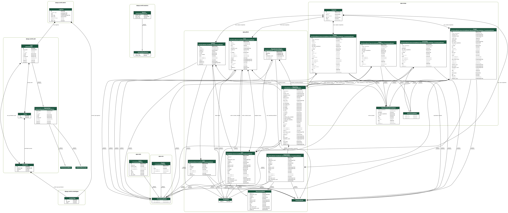

# [OWASP Nest](https://nest.owasp.org/)

  

**OWASP Nest** is a comprehensive platform designed to enhance collaboration and contribution within the OWASP community. The application serves as a central hub for exploring OWASP projects and ways to contribute to them, empowering contributors to find opportunities that align with their interests and expertise.

Key features of the platform include:

- **Advanced Search Capabilities:** Enables efficient navigation and filtering of projects and issues based on keywords, tags, and contributor preferences.
- **Slack Integration:** Supports seamless communication through a [Slack bot](https://owasp.slack.com/team/U07M1C4JASK) that facilitates direct and channel messaging for updates and discussions.
- **OWASP Chapters Proximity Page:** Offers localized information about nearby OWASP chapters to foster community engagement.
- **AI-Generated Insights:** Provides summarized descriptions and actionable steps for tackling project issues.

OWASP Nest promotes collaboration, making it easier for both new and experienced contributors to engage meaningfully with OWASP's mission to improve software security worldwide.

## Leaders

OWASP Nest is led by a dedicated team committed to fostering collaboration and supporting contributors. The leadership team ensures the platform aligns with OWASP's mission, continually improving its features to serve the community better.
Current Leaders:

- [Arkadii Yakovets](https://github.com/arkid15r/)
- [Kate Golovanova](https://github.com/kasya/)
- [Starr Brown](https://github.com/mamicidal/)

For questions or discussions with the leadership team and other contributors, please use the [#project-nest](https://owasp.slack.com/archives/project-nest) channel on OWASP Slack.

## Contributing

OWASP Nest thrives on community contributions. Whether you are a developer, designer, writer, or enthusiast, there are various ways to get involved:

- Code Contributions: Help improve the platform by fixing issues or adding new features.
- Code Review: Review and provide feedback on pull requests to ensure code quality and maintainability.
- Documentation: Enhance user guides or create tutorials to help others navigate the platform.
- Issue Reporting: Identify and report bugs or suggest improvements.
- Engagement: Share feedback, participate in discussions, or promote the project in your network.

## Django Models Graph

The following is an auto-generated visualization of our Django models:

To get started, visit the [OWASP Nest Repository](https://github.com/OWASP/Nest), explore the [Contributing Guidelines](https://github.com/OWASP/Nest/blob/main/CONTRIBUTING.md), and [Code of Conduct](https://github.com/OWASP/Nest/blob/main/CODE_OF_CONDUCT.md).
