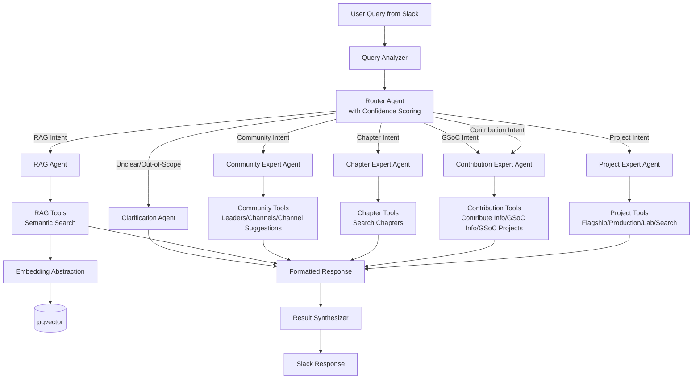

# Design Document: Production-Ready AI Assistant for OWASP Slack

## Problem Statement

The current AI assistant in NestBot is far from production readiness due to:

1. **Response Quality Issues**: Inconsistent and sometimes inaccurate responses to OWASP-related questions
2. **Lack of Intent Differentiation**: Unable to distinguish between queries requiring:
   - Static responses (e.g., "How do I contribute?")
   - Tool-based lookups (e.g., "List flagship projects")
   - RAG processing (e.g., "What are OWASP's policies on X?")
   - Clarification (e.g., unclear or out-of-scope questions)
3. **Vendor Lock-in**: Direct dependency on OpenAI API without abstraction layer
4. **Limited Routing Intelligence**: Current `QuestionDetector` only performs binary OWASP relevance check
5. **No Semantic Caching**: Every query hits the LLM, increasing cost and latency

**Goal**: Build a production-ready, multi-layer AI assistant that intelligently routes queries, provides high-quality responses, and maintains vendor-agnostic architecture.

## Requirements

### Functional Requirements

1. **Intent Classification**: Accurately classify user queries into:
   - Project queries (questions about OWASP projects)
   - Contribution queries (questions about contributing to OWASP)
   - GSoC queries (questions about Google Summer of Code with OWASP)
   - Chapter queries (questions about OWASP chapters)
   - RAG-required questions (complex questions needing context retrieval)
   - Clarification needed (unclear or out-of-scope)


2. **Expert Agent Responses**: Route queries to specialized expert agents:
   - **Contribution Expert**: Provides contribution guidance, GSoC information, and suggests #contribute channel
   - **Project Expert**: Provides project information by level (flagship, production, lab, incubator) or search
   - **Chapter Expert**: Provides chapter information and location-based searches
   - **Community Expert**: Handles community member queries, entity leaders, channels, and channel suggestions
   - **RAG Agent**: Handles complex questions requiring context retrieval
   - **Clarification Agent**: Handles unclear or out-of-scope questions

4. **RAG Processing**: Answer complex questions using:
   - Semantic search over OWASP content (www-* repositories)
   - Context-aware generation
   - Citation of sources

5. **Clarification Handling**: For unclear or out-of-scope questions:
   - Ask for clarification
   - State scope limitations (OWASP-related only)

6. **OWASP Relevance Check**: Ensure all responses are OWASP-related

### Non-Functional Requirements

1. **Vendor Agnostic**:
   - Abstract embedding generation (OpenAI as current implementation)
   - Abstract LLM provider (CrewAI supports multiple providers)
   - Storage-agnostic (use existing pgvector infrastructure)

2. **Performance**:
   - Response time < 5 seconds for expert agent responses
   - Response time < 15 seconds for RAG responses
   - Efficient routing with confidence scoring

3. **Cost Optimization**:
   - Route simple queries to expert agents (faster, cheaper)
   - Use RAG only for complex questions requiring context
   - Multi-step execution only when needed

4. **Maintainability**:
   - Clean separation of concerns (agents, tools, flows)
   - Comprehensive testing
   - Clear documentation

5. **Backward Compatibility**:
   - Maintain existing Slack command interface
   - Gradual migration path

## Design

### Architecture Overview

The system uses CrewAI's multi-agent architecture with expert agents and intelligent routing:



### Core Components

#### 1. Router Agent (Top Level)
- **Location**: `apps/ai/router/`
- **Role**: Intent Classifier with Confidence Scoring
- **Goal**: Accurately classify user queries with confidence scores and route to appropriate expert agent
- **Backstory**: Expert at understanding user intent and assessing confidence in classification
- **Responsibilities**:
  - Classify query intent (project, contribution, gsoc, chapter, community, rag, clarification)
  - Provide confidence scores (0.0-1.0)
  - Suggest alternative intents when confidence is low
  - Route to appropriate expert agent

#### 2. Project Expert Agent
- **Location**: `apps/ai/agents/project/`
- **Role**: OWASP Project Specialist
- **Goal**: Provide accurate, detailed information about OWASP projects
- **Backstory**: Expert on OWASP projects with deep knowledge of project maturity levels, technologies, and use cases
- **Tools** (in `tools/` directory):
  - `get_flagship_projects`: Get all flagship projects
  - `get_production_projects`: Get all production projects
  - `get_lab_projects`: Get all lab projects
  - `get_incubator_projects`: Get all incubator projects
  - `search`: Search projects by name, topic, technology, or description
  - `get_project_age`: Get project creation date or list all projects with creation dates

#### 3. Contribution Expert Agent
- **Location**: `apps/ai/agents/contribution/`
- **Role**: OWASP Contribution and GSoC Specialist
- **Goal**: Help users understand how to contribute to OWASP projects and participate in Google Summer of Code
- **Backstory**: Expert on OWASP contributions and GSoC with deep knowledge of the contribution process, GSoC program, and finding opportunities
- **Tools** (in `tools/` directory):
  - `get_contribute_info`: Returns contribution guide content with #contribute channel suggestion (in `contribute_info.py`)
  - `get_gsoc_info`: Get general information about OWASP GSoC program (in `gsoc_info.py`)
  - `get_gsoc_project_info`: Get GSoC projects for a specific year (in `gsoc_project_info.py`)

#### 4. Chapter Expert Agent
- **Location**: `apps/ai/agents/chapter/`
- **Role**: OWASP Chapter Specialist
- **Goal**: Help users find and connect with OWASP chapters
- **Backstory**: Expert on OWASP chapters worldwide, chapter locations, and activities
- **Tools** (in `tools.py`):
  - `search_chapters`: Search for OWASP chapters by location or name

#### 5. Community Expert Agent
- **Location**: `apps/ai/agents/community/`
- **Role**: OWASP Community Specialist
- **Goal**: Help users find community members, entity leaders, channels, and suggest appropriate channels for questions
- **Backstory**: Expert on OWASP community members, entity leadership, and communication channels
- **Tools** (in `tools/` directory):
  - `get_entity_leaders`: Get leaders for projects/chapters/committees or find what entities a person leads (in `leaders.py`)
  - `get_entity_channels`: Get Slack channels for specific OWASP entities (in `channels.py`)
  - `suggest_contribute_channel`: Suggest #contribute channel for contribution questions (in `suggest_channel/contribute.py`)
  - `suggest_gsoc_channel`: Suggest #gsoc channel for GSoC questions (in `suggest_channel/gsoc.py`)

#### 6. RAG Agent
- **Location**: `apps/ai/agents/rag/`
- **Role**: OWASP Knowledge Specialist
- **Goal**: Answer complex OWASP questions using retrieved context
- **Backstory**: Expert at synthesizing information from multiple sources to provide comprehensive answers
- **Tools** (in `tools.py`):
  - `semantic_search`: Search OWASP content using embeddings (vendor-agnostic)

#### 7. Clarification Agent
- **Location**: `apps/ai/agents/clarification/`
- **Role**: Clarification Specialist
- **Goal**: Handle unclear or out-of-scope questions
- **Backstory**: Expert at identifying when questions need clarification or are outside OWASP scope
- **Responsibilities**:
  - Ask clarifying questions for ambiguous queries
  - Politely decline non-OWASP questions
  - Guide users to appropriate resources

### Embedding Abstraction Layer (Vendor-Agnostic)

Create an abstraction layer for embedding generation that allows switching providers without changing consuming code:

```python
# apps/ai/embeddings/base.py
from abc import ABC, abstractmethod
from typing import List

class Embedder(ABC):
    """Abstract base class for embedding providers."""

    @abstractmethod
    def embed_query(self, text: str) -> List[float]:
        """Generate embedding for a query string."""
        pass

    @abstractmethod
    def embed_documents(self, texts: List[str]) -> List[List[float]]:
        """Generate embeddings for multiple documents."""
        pass

    @abstractmethod
    def get_dimensions(self) -> int:
        """Get the dimension of embeddings produced by this embedder."""
        pass

# apps/ai/embeddings/openai.py
from apps.ai.embeddings.base import Embedder
from openai import OpenAI

class OpenAIEmbedder(Embedder):
    """OpenAI implementation of embedder."""

    def __init__(self, model: str = "text-embedding-3-small"):
        self.client = OpenAI(api_key=settings.OPEN_AI_SECRET_KEY)
        self.model = model
        self._dimensions = 1536  # text-embedding-3-small dimensions

    def embed_query(self, text: str) -> List[float]:
        response = self.client.embeddings.create(
            model=self.model,
            input=text
        )
        return response.data[0].embedding

    def embed_documents(self, texts: List[str]) -> List[List[float]]:
        response = self.client.embeddings.create(
            model=self.model,
            input=texts
        )
        return [item.embedding for item in response.data]

    def get_dimensions(self) -> int:
        return self._dimensions

# apps/ai/embeddings/factory.py
from apps.ai.embeddings.openai import OpenAIEmbedder
from apps.ai.embeddings.base import Embedder

def get_embedder() -> Embedder:
    """Factory function to get the configured embedder."""
    # Currently OpenAI, but can be extended to support other providers
    return OpenAIEmbedder()
```

### RAG Tools Implementation (Vendor-Agnostic with Embedding Abstraction)

The RAG functionality uses the embedding abstraction layer with existing pgvector storage:

```python
# apps/ai/crewai/agents/rag/tools.py
from crewai.tools import tool
from apps.ai.models.chunk import Chunk
from apps.ai.embeddings.factory import get_embedder
from pgvector.django.functions import CosineDistance
from typing import List, Dict

@tool("Semantic search for OWASP content")
def semantic_search(query: str, limit: int = 5) -> List[Dict[str, str]]:
    """Search OWASP content using semantic similarity.

    Args:
        query: The search query
        limit: Maximum number of results to return

    Returns:
        List of dictionaries with 'text' and 'context' keys
    """
    embedder = get_embedder()
    query_embedding = embedder.embed_query(query)

    # Search pgvector using cosine distance
    chunks = Chunk.objects.annotate(
        distance=CosineDistance('embedding', query_embedding)
    ).order_by('distance')[:limit]

    return [
        {
            'text': chunk.text,
            'context': str(chunk.context),
            'distance': float(chunk.distance)
        }
        for chunk in chunks
    ]
```

### CrewAI Flow Implementation

Use CrewAI's multi-agent system with expert agents, query decomposition, and enhanced routing:

```python
# apps/ai/crewai/flows/assistant.py
from crewai import Agent, Task, Crew
from apps.ai.crewai.router import route_with_confidence
from apps.ai.crewai.common.query_analyzer import analyze_query
from apps.ai.crewai.agents.project import create_project_agent
from apps.ai.crewai.agents.contribution import create_contribution_agent
from apps.ai.crewai.agents.gsoc import create_gsoc_agent
from apps.ai.crewai.agents.chapter import create_chapter_agent
from apps.ai.crewai.agents.rag import create_rag_agent
from apps.ai.crewai.agents.clarification import create_clarification_agent
from apps.ai.crewai.flows.collaborative import handle_collaborative_query
from apps.ai.crewai.agents.synthesizer import synthesize_results

def process_query(query: str) -> str:
    """Process query with enhanced accuracy mechanisms."""

    # Step 1: Analyze query complexity and determine required agents/tools
    # This happens FIRST to understand what's needed before routing
    analysis = analyze_query(query)

    # Step 2: Check if multiple agents needed (from query decomposition)
    if len(analysis["required_agents"]) > 1:
        # Use collaborative flow with agents/tools identified by query analyzer
        return handle_collaborative_query(
            query=query,
            required_agents=analysis["required_agents"],
            required_tools=analysis["required_tools"],
            sub_queries=analysis["sub_queries"]
        )

    # Step 3: Route with confidence (for single-agent queries)
    router_result = route_with_confidence(query)

    # Step 4: Handle based on complexity
    if analysis["is_simple"]:
        return execute_query_with_refinement(
            router_result["intent"],
            query
        )
    else:
        return execute_multi_step_query(
            router_result["intent"],
            query,
            analysis["sub_queries"],
            analysis["required_tools"]
        )

def execute_query_with_refinement(intent: str, query: str) -> str:
    """Execute query with self-correction refinement."""
    from apps.ai.crewai.agents import INTENT_TO_AGENT

    agent_factory = INTENT_TO_AGENT.get(intent)
    if not agent_factory:
        return get_fallback_response()

    agent = agent_factory()

    # Initial answer task
    answer_task = Task(
        description=f"Answer this query: {query}",
        agent=agent,
        expected_output="Initial answer to the query",
    )

    # Refinement task
    refinement_task = Task(
        description=(
            f"Review and refine your previous answer for: {query}\n\n"
            f"Check for accuracy, completeness, and clarity. Provide refined answer."
        ),
        agent=agent,
        expected_output="Refined, accurate, and complete answer",
        context=[answer_task],
    )

    crew = Crew(agents=[agent], tasks=[answer_task, refinement_task], verbose=True)
    result = crew.kickoff()
    return str(result)

def execute_multi_step_query(
    intent: str,
    query: str,
    sub_queries: list[str],
    required_tools: list[str]
) -> str:
    """Execute multi-step query with tool selection and synthesis."""
    from apps.ai.crewai.agents import INTENT_TO_AGENT

    agent_factory = INTENT_TO_AGENT.get(intent)
    if not agent_factory:
        return get_fallback_response()

    agent = agent_factory()

    # Tool selection task
    tool_selection_task = Task(
        description=(
            f"For query: {query}\n\n"
            f"Sub-queries: {', '.join(sub_queries)}\n"
            f"Required tools: {', '.join(required_tools)}\n\n"
            f"Which tools should be used for each sub-query? Create a plan."
        ),
        agent=agent,
        expected_output="Tool selection plan",
    )

    # Execute for each sub-query
    execution_tasks = []
    for sub_query in sub_queries:
        task = Task(
            description=(
                f"Answer sub-query: {sub_query}\n\n"
                f"Use the tool selection plan from previous task."
            ),
            agent=agent,
            expected_output=f"Answer to: {sub_query}",
            context=[tool_selection_task],
        )
        execution_tasks.append(task)

    # Synthesize results
    synthesis_task = Task(
        description=(
            f"Original query: {query}\n\n"
            f"Sub-query results from previous tasks.\n\n"
            f"Synthesize these results into a coherent, complete answer."
        ),
        agent=agent,
        expected_output="Synthesized, coherent answer to the original query",
        context=execution_tasks,
    )

    all_tasks = [tool_selection_task] + execution_tasks + [synthesis_task]
    crew = Crew(agents=[agent], tasks=all_tasks, verbose=True)
    result = crew.kickoff()
    return str(result)

def get_fallback_response() -> str:
    """Get fallback response on error."""
    return (
        "⚠️ I encountered an error processing your request. "
        "Please try rephrasing your question or contact support if the issue persists."
    )
```

### Collaborative Flow Implementation

The collaborative flow uses query decomposition results to orchestrate multiple agents:

```python
# apps/ai/crewai/flows/collaborative.py
from crewai import Agent, Task, Crew
from apps.ai.crewai.agents.project import create_project_agent
from apps.ai.crewai.agents.contribution import create_contribution_agent
from apps.ai.crewai.agents.gsoc import create_gsoc_agent
from apps.ai.crewai.agents.chapter import create_chapter_agent
from apps.ai.crewai.agents.rag import create_rag_agent
from apps.ai.crewai.agents.synthesizer import create_synthesizer_agent
from apps.ai.crewai.common.intent import Intent

# Agent factory mapping
AGENT_FACTORIES = {
    "project": create_project_agent,
    "contribution": create_contribution_agent,
    "gsoc": create_gsoc_agent,
    "chapter": create_chapter_agent,
    "rag": create_rag_agent,
}

def handle_collaborative_query(
    query: str,
    required_agents: list[str],
    required_tools: list[str],
    sub_queries: list[str]
) -> str:
    """Handle collaborative query using query decomposition results.

    Args:
        query: Original user query
        required_agents: List of agent names from query decomposition
        required_tools: List of tool names from query decomposition
        sub_queries: List of sub-queries from query decomposition

    Returns:
        Synthesized response from multiple agents
    """
    # Step 1: Create agents based on query decomposition
    agents = []
    agent_map = {}

    for agent_name in required_agents:
        if agent_name in AGENT_FACTORIES:
            agent = AGENT_FACTORIES[agent_name]()
            agents.append(agent)
            agent_map[agent_name] = agent

    # Step 2: Create tasks for each sub-query
    tasks = []
    for i, sub_query in enumerate(sub_queries):
        # Match sub-query to appropriate agent
        # This could be enhanced with LLM-based matching
        agent_name = match_subquery_to_agent(sub_query, required_agents)
        agent = agent_map[agent_name]

        task = Task(
            description=(
                f"Answer this sub-query: {sub_query}\n\n"
                f"Use the appropriate tools from: {', '.join(required_tools)}\n"
                f"Original query context: {query}"
            ),
            agent=agent,
            expected_output=f"Answer to: {sub_query}",
        )
        tasks.append(task)

    # Step 3: Execute tasks
    crew = Crew(agents=agents, tasks=tasks, verbose=True)
    results = crew.kickoff()

    # Step 4: Synthesize results
    synthesizer = create_synthesizer_agent()
    synthesis_task = Task(
        description=(
            f"Original query: {query}\n\n"
            f"Sub-query results:\n{results}\n\n"
            f"Synthesize these results into a coherent, complete answer."
        ),
        agent=synthesizer,
        expected_output="Synthesized, coherent answer to the original query",
    )

    synthesis_crew = Crew(agents=[synthesizer], tasks=[synthesis_task])
    final_result = synthesis_crew.kickoff()

    return str(final_result)

def match_subquery_to_agent(sub_query: str, available_agents: list[str]) -> str:
    """Match sub-query to appropriate agent (simplified version).

    In production, this could use LLM-based matching for better accuracy.
    """
    # Simple keyword-based matching
    sub_query_lower = sub_query.lower()

    if "project" in sub_query_lower and "project" in available_agents:
        return "project"
    if "contribute" in sub_query_lower and "contribution" in available_agents:
        return "contribution"
    if "gsoc" in sub_query_lower or "summer of code" in sub_query_lower:
        if "gsoc" in available_agents:
            return "gsoc"
    if "chapter" in sub_query_lower and "chapter" in available_agents:
        return "chapter"

    # Default to first available agent
    return available_agents[0]
```

### Query Analyzer Implementation

The query analyzer is central to determining when collaborative flows are needed:

```python
# apps/ai/crewai/common/query_analyzer.py
from crewai import Agent, Task, Crew
from typing import Dict, List, Any
import json

def analyze_query(query: str) -> Dict[str, Any]:
    """Analyze query to determine complexity and required agents/tools.

    Args:
        query: User's question

    Returns:
        Dictionary with:
        - is_simple: bool
        - sub_queries: List[str]
        - required_agents: List[str]
        - required_tools: List[str]
    """
    analyzer_agent = Agent(
        role="Query Analyzer",
        goal=(
            "Analyze user queries to determine complexity, required agents, "
            "and tools needed to answer the query accurately."
        ),
        backstory=(
            "You are an expert at understanding query complexity and "
            "identifying what information sources are needed. You break down "
            "complex queries into sub-queries and identify which expert agents "
            "and tools are required."
        ),
        verbose=True,
        allow_delegation=False,
    )

    analysis_task = Task(
        description=(
            f"Analyze this query: {query}\n\n"
            "Determine:\n"
            "1. Is this a simple query (one tool) or complex (multiple steps)?\n"
            "2. What sub-queries need to be answered?\n"
            "3. Which expert agents are needed? (project, contribution, gsoc, chapter, rag)\n"
            "4. Which tools are needed? (list specific tool names)\n\n"
            "Return your analysis as JSON with keys: "
            "is_simple, sub_queries, required_agents, required_tools"
        ),
        agent=analyzer_agent,
        expected_output=(
            "JSON object with keys: is_simple (bool), sub_queries (list), "
            "required_agents (list), required_tools (list)"
        ),
    )

    crew = Crew(agents=[analyzer_agent], tasks=[analysis_task], verbose=True)
    result = crew.kickoff()

    # Parse JSON result
    try:
        # Extract JSON from result string
        result_str = str(result)
        # Find JSON object in result
        json_start = result_str.find('{')
        json_end = result_str.rfind('}') + 1
        if json_start >= 0 and json_end > json_start:
            json_str = result_str[json_start:json_end]
            analysis = json.loads(json_str)
        else:
            # Fallback: try parsing entire result
            analysis = json.loads(result_str)
    except json.JSONDecodeError:
        # Fallback analysis
        analysis = {
            "is_simple": True,
            "sub_queries": [query],
            "required_agents": [],
            "required_tools": []
        }

    # Validate and normalize
    return {
        "is_simple": analysis.get("is_simple", True),
        "sub_queries": analysis.get("sub_queries", [query]),
        "required_agents": analysis.get("required_agents", []),
        "required_tools": analysis.get("required_tools", [])
    }
```

### Architectural Improvements for Accuracy

The architecture includes several mechanisms to improve response accuracy:

#### 1. Multi-Step Task Execution
Complex queries are broken into subtasks with tool chaining. For example:
- **Analysis Task**: Understand query and plan tool usage
- **Execution Task**: Execute tools based on plan
- **Synthesis Task**: Combine results into coherent answer

#### 2. Enhanced Router with Confidence Scoring
Router provides:
- **Confidence scores** (0.0-1.0) for each classification
- **Alternative intents** when confidence is low
- **Reasoning** for the classification decision
- **Fallback to clarification** when confidence < 0.7

#### 3. Agent Collaboration with Query Decomposition
Query decomposition identifies when multiple agents are needed, then collaborative flows orchestrate them:

**Query Decomposition Analysis**:
- Analyzes query to identify required agents and tools
- Breaks down complex queries into sub-queries
- Determines execution order and dependencies

**Collaborative Flow Execution**:
- Uses identified agents from query analysis
- Executes tasks in proper sequence
- Passes results between agents as context
- Synthesizes final response

**Example**: "How can I contribute to flagship projects?"
- Query Analyzer identifies: `required_agents: ["project", "contribution"]`
- Query Analyzer identifies: `required_tools: ["get_flagship_projects", "get_contribute_info"]`
- Collaborative flow:
  1. Project Agent uses `get_flagship_projects` tool
  2. Contribution Agent uses `get_contribute_info` tool with project results as context
  3. Synthesizer combines both results into final answer

#### 4. Self-Correction
Agents refine their own answers through iterative refinement:
- **Initial Answer Task**: First attempt at answering
- **Correction Task**: Review and refine for accuracy, completeness, and clarity

#### 5. Context-Aware Tool Selection
Explicit tool selection step before execution:
- **Tool Selection Task**: Analyze query and select appropriate tools
- **Execution Task**: Execute selected tools based on plan

#### 6. Query Decomposition
Query analyzer breaks down complex queries and drives collaborative flow decisions:

**Analysis Output**:
- `is_simple`: Boolean indicating if query needs one tool or multiple steps
- `sub_queries`: List of decomposed sub-queries for complex queries
- `required_agents`: List of agent names needed (e.g., ["project", "contribution"])
- `required_tools`: List of tool names needed (e.g., ["get_flagship_projects", "get_contribute_info"])

**Usage in Collaborative Flows**:
- Query decomposition happens FIRST before routing
- If `required_agents` has multiple agents → use collaborative flow
- Collaborative flow uses `required_agents` and `required_tools` to:
  - Instantiate correct agents
  - Assign appropriate tools to each agent
  - Create tasks for each sub-query
  - Orchestrate execution order

**Example Analysis**:
```python
Query: "How can I contribute to flagship projects in London?"

Analysis Result:
{
    "is_simple": False,
    "sub_queries": [
        "What are flagship projects?",
        "How to contribute to OWASP?",
        "Are there chapters in London?"
    ],
    "required_agents": ["project", "contribution", "chapter"],
    "required_tools": ["get_flagship_projects", "get_contribute_info", "search_chapters"]
}
```

#### 7. Enhanced Task Descriptions
Tasks include:
- **Examples**: Show correct tool usage patterns
- **Guidelines**: Best practices for tool usage
- **Constraints**: Formatting and structure requirements
- **Expected Output**: Clear description of desired result

#### 8. Result Synthesis
Dedicated synthesizer agent combines multiple tool results:
- Removes duplicates
- Organizes by relevance
- Ensures completeness
- Creates coherent final response

### Error Handling and Resilience

The system includes comprehensive error handling:

```python
# apps/ai/crewai/flows/assistant.py
import logging
from typing import Optional

logger = logging.getLogger(__name__)

def process_query(query: str) -> str:
    """Process query with error handling."""
    try:
        # ... main processing logic ...
    except Exception as e:
        logger.exception("Failed to process query: %s", query)
        return get_fallback_response()

def handle_collaborative_query(...) -> str:
    """Handle collaborative query with error recovery."""
    try:
        # ... collaborative flow logic ...
    except Exception as e:
        logger.exception("Collaborative flow failed, falling back to single agent")
        # Fallback to single agent
        return execute_query_with_refinement(intent, query)
```

**Error Handling Strategies**:
- **Tool Failures**: Catch tool exceptions, log, and continue with available tools
- **Agent Failures**: Fallback to clarification agent
- **LLM Failures**: Retry with exponential backoff, then fallback response
- **Timeout Handling**: Set timeouts for LLM calls, return partial results if needed

### LLM Configuration and Provider Abstraction

CrewAI supports multiple LLM providers. Configuration:

```python
# apps/ai/crewai/config.py
from crewai import LLM
import os

def get_llm() -> LLM:
    """Get configured LLM instance."""
    provider = os.getenv("LLM_PROVIDER", "openai")

    if provider == "openai":
        return LLM(
            model="gpt-4o",
            api_key=os.getenv("DJANGO_OPEN_AI_SECRET_KEY"),
            temperature=0.1,
        )
    elif provider == "anthropic":
        return LLM(
            model="claude-3-5-sonnet-20241022",
            api_key=os.getenv("ANTHROPIC_API_KEY"),
            temperature=0.1,
        )
    # Add more providers as needed

    raise ValueError(f"Unsupported LLM provider: {provider}")

# Use in agents
agent = Agent(
    role="...",
    llm=get_llm(),
    # ... other config ...
)
```

### Logging and Monitoring

Comprehensive logging for debugging and monitoring:

```python
# apps/ai/crewai/common/logging.py
import logging
import time
from functools import wraps

logger = logging.getLogger(__name__)

def log_execution_time(func):
    """Decorator to log execution time."""
    @wraps(func)
    def wrapper(*args, **kwargs):
        start_time = time.time()
        try:
            result = func(*args, **kwargs)
            duration = time.time() - start_time
            logger.info(
                f"{func.__name__} completed in {duration:.2f}s",
                extra={"duration": duration, "function": func.__name__}
            )
            return result
        except Exception as e:
            duration = time.time() - start_time
            logger.error(
                f"{func.__name__} failed after {duration:.2f}s",
                extra={"duration": duration, "error": str(e)},
                exc_info=True
            )
            raise
    return wrapper

# Usage
@log_execution_time
def process_query(query: str) -> str:
    # ... implementation ...
```

**Monitoring Metrics**:
- Query processing time
- Agent execution time
- Tool call counts and durations
- Error rates by agent/tool
- Router confidence scores
- LLM token usage

### Response Formatting for Slack

Format responses for Slack's markdown:

```python
# apps/ai/crewai/common/formatters.py
def format_slack_response(response: str) -> str:
    """Format response for Slack markdown."""
    # Ensure proper Slack markdown formatting
    # - Convert markdown links to Slack format
    # - Handle code blocks
    # - Format lists properly
    # - Limit message length (Slack has 4000 char limit)

    if len(response) > 3500:
        response = response[:3500] + "\n\n... (response truncated)"

    return response
```

### Tool Registration and Agent Integration

Tools are registered with agents using CrewAI's `@tool` decorator. Each tool is in its own file within the `tools/` directory:

```python
# apps/ai/agents/contribution/tools/contribute_info.py
from crewai.tools import tool
from apps.ai.common.decorators import render_template

@tool("Get OWASP contribution information and guide users to #contribute channel")
def get_contribute_info() -> str:
    """Get information about contributing to OWASP.

    Returns:
        Formatted string with contribution information and #contribute channel suggestion
    """
    return render_template("agents/contribution/tools/get_contribute_info.jinja")

# apps/ai/agents/contribution/agent.py
from crewai import Agent
from apps.ai.agents.contribution.tools import (
    get_contribute_info,
    get_gsoc_info,
    get_gsoc_project_info,
)

def create_contribution_agent() -> Agent:
    """Create Contribution Expert Agent with tools."""
    return Agent(
        role="OWASP Contribution Specialist",
        goal="Help users understand how to contribute to OWASP projects",
        backstory="You are an expert on OWASP contributions",
        tools=[
            get_contribute_info,
            get_gsoc_info,
            get_gsoc_project_info,
        ],
        verbose=True,
        allow_delegation=False,
        memory=False,
    )
```

**Template Rendering**:
- The `render_template()` function (in `apps/ai/common/decorators.py`) is used to render Jinja2 templates
- Templates are stored in `apps/ai/templates/agents/<agent>/tools/`
- Context can be provided via `context_factory` parameter for dynamic values

**Tool Best Practices**:
- Clear, descriptive tool names with `get_` prefix
- File names without `get_` prefix (e.g., `contribute_info.py` contains `get_contribute_info()`)
- Comprehensive docstrings with usage examples
- Type hints for parameters
- Error handling within tools
- Return formatted strings (not raw data structures)
- Use `render_template()` for template-based tools

### Configuration Management

Centralized configuration:

```python
# apps/ai/crewai/config.py
from dataclasses import dataclass
import os

@dataclass
class CrewAIConfig:
    """CrewAI assistant configuration."""
    # Router settings
    router_confidence_threshold: float = 0.7

    # Agent settings
    agent_temperature: float = 0.1
    agent_max_iterations: int = 15

    # Tool settings
    tool_timeout: int = 30  # seconds

    # Flow settings
    max_collaborative_agents: int = 5
    query_analyzer_enabled: bool = True

    @classmethod
    def from_env(cls) -> "CrewAIConfig":
        """Load configuration from environment variables."""
        return cls(
            router_confidence_threshold=float(
                os.getenv("CREWAI_ROUTER_CONFIDENCE", "0.7")
            ),
            agent_temperature=float(
                os.getenv("CREWAI_AGENT_TEMPERATURE", "0.1")
            ),
            # ... load other settings ...
        )
```

### Directory Structure

```text
apps/ai/
├── __init__.py
├── router/
│   ├── __init__.py
│   └── agent.py              # Router agent with confidence scoring
├── agents/
│   ├── __init__.py
│   ├── project/
│   │   ├── __init__.py
│   │   ├── agent.py
│   │   └── tools/            # Project-specific tools
│   │       ├── __init__.py
│   │       ├── get_flagship_projects.py
│   │       ├── get_production_projects.py
│   │       ├── get_lab_projects.py
│   │       ├── get_incubator_projects.py
│   │       ├── search.py
│   │       ├── age.py
│   │       └── formatters.py
│   ├── contribution/
│   │   ├── __init__.py
│   │   ├── agent.py
│   │   └── tools/            # Contribution and GSoC tools
│   │       ├── __init__.py
│   │       ├── contribute_info.py    # get_contribute_info()
│   │       ├── gsoc_info.py         # get_gsoc_info()
│   │       └── gsoc_project_info.py  # get_gsoc_project_info()
│   ├── chapter/
│   │   ├── __init__.py
│   │   ├── agent.py
│   │   └── tools.py           # Chapter tools
│   ├── community/
│   │   ├── __init__.py
│   │   ├── agent.py
│   │   └── tools/            # Community tools
│   │       ├── __init__.py
│   │       ├── leaders.py
│   │       ├── channels.py
│   │       └── suggest_channel/
│   │           ├── __init__.py
│   │           ├── contribute.py
│   │           └── gsoc.py
│   ├── rag/
│   │   ├── __init__.py
│   │   ├── agent.py
│   │   └── tools.py           # RAG tools
│   └── clarification/
│       ├── __init__.py
│       └── agent.py
├── flows/
│   ├── __init__.py
│   └── assistant.py           # Main flow
├── common/
│   ├── __init__.py
│   ├── intent.py              # Intent enums and validation
│   ├── llm_config.py          # LLM configuration
│   ├── decorators.py          # render_template function
│   └── utils.py
├── templates/
│   ├── agents/                # Agent backstories and tool templates
│   │   ├── contribution/
│   │   ├── project/
│   │   ├── community/
│   │   └── ...
│   └── router/                # Router templates
└── template_loader.py         # Jinja2 template loader
```

**File Naming Convention**:
- Tool files: No `get_` prefix (e.g., `contribute_info.py`, `gsoc_info.py`, `gsoc_project_info.py`)
- Tool functions: `get_` prefix (e.g., `get_contribute_info()`, `get_gsoc_info()`, `get_gsoc_project_info()`)

## Implementation

### Phase 1: Foundation (Week 1-2)

1. **Add CrewAI dependency**:
   ```toml
   # pyproject.toml
   crewai = "^0.80.0"
   ```

2. **Create embedding abstraction layer**:
   - `apps/ai/embeddings/base.py`: Abstract base class
   - `apps/ai/embeddings/openai.py`: OpenAI implementation
   - `apps/ai/embeddings/factory.py`: Factory function

3. **Create CrewAI directory structure**:
   - `apps/ai/crewai/`
   - `apps/ai/crewai/router/`
   - `apps/ai/crewai/agents/` (with subdirectories for each expert)
   - `apps/ai/crewai/flows/`
   - `apps/ai/crewai/common/`

### Phase 2: Tools Development (Week 2-3)

1. **Create contribution tools**:
   - `apps/ai/crewai/agents/contribution/tools.py`: Contribution info tool

2. **Create project tools**:
   - `apps/ai/crewai/agents/project/tools.py`: Flagship, production, lab, incubator, search tools
   - Integrate with existing Algolia search functions

3. **Create GSoC tools**:
   - `apps/ai/crewai/agents/gsoc/tools.py`: GSoC info and projects by year tools

4. **Create chapter tools**:
   - `apps/ai/agents/chapter/tools.py`: Chapter search tool
   - Integrate with existing Algolia search functions

5. **Create community tools**:
   - `apps/ai/agents/community/tools/leaders.py`: Entity leaders tool
   - `apps/ai/agents/community/tools/channels.py`: Entity channels tool
   - `apps/ai/agents/community/tools/suggest_channel/contribute.py`: Suggest #contribute channel
   - `apps/ai/agents/community/tools/suggest_channel/gsoc.py`: Suggest #gsoc channel

6. **Create RAG tools**:
   - `apps/ai/agents/rag/tools.py`: Semantic search tool using embedding abstraction

7. **Unit tests for all tools**

### Phase 3: Agents Development (Week 3-4)

1. **Create Router Agent** (Top Level):
   - `apps/ai/router/agent.py`
   - Intent classification with confidence scoring
   - Alternative intent suggestions

2. **Create Project Expert Agent**:
   - `apps/ai/agents/project/agent.py`
   - Uses project tools
   - Supports multi-step execution

3. **Create Contribution Expert Agent** (includes GSoC):
   - `apps/ai/agents/contribution/agent.py`
   - Uses contribution and GSoC tools

4. **Create Chapter Expert Agent**:
   - `apps/ai/agents/chapter/agent.py`
   - Uses chapter tools

5. **Create Community Expert Agent**:
   - `apps/ai/agents/community/agent.py`
   - Uses community tools (leaders, channels, channel suggestions)

6. **Create RAG Agent**:
   - `apps/ai/agents/rag/agent.py`
   - Uses RAG tools

7. **Create Clarification Agent**:
   - `apps/ai/agents/clarification/agent.py`

8. **Create Common Utilities**:
   - `apps/ai/common/intent.py`: Intent enums and validation
   - `apps/ai/common/llm_config.py`: LLM configuration
   - `apps/ai/common/decorators.py`: Template rendering utilities

9. **Create Template System**:
   - `apps/ai/template_loader.py`: Jinja2 template loader
   - `apps/ai/templates/agents/`: Agent backstories and tool templates
   - `apps/ai/templates/router/`: Router templates

10. **Unit tests for all agents**

### Phase 4: Flow Integration (Week 4-5)

1. **Create query analyzer** (if not done in Phase 3):
   - `apps/ai/crewai/common/query_analyzer.py`
   - Implement query decomposition logic
   - Identify required agents and tools from query analysis
   - Return structured analysis results

2. **Create collaborative flow**:
   - `apps/ai/crewai/flows/collaborative.py`
   - Use query analyzer results to determine required agents/tools
   - Orchestrate multiple agents based on `required_agents` from query analysis
   - Create tasks for each sub-query from query decomposition
   - Pass results between agents as context
   - Use synthesizer to combine final results

3. **Create main flow**:
   - `apps/ai/crewai/flows/assistant.py`
   - Integrate query analyzer (runs FIRST)
   - Check `required_agents` from analysis to determine if collaborative flow needed
   - Implement enhanced routing with confidence scoring (for single-agent queries)
   - Add multi-step execution for complex single-agent queries
   - Add self-correction mechanisms

4. **Integrate with Slack handler**:
   - Update `apps/slack/common/handlers/ai.py`
   - Replace `AgenticRAGAgent` with CrewAI flow
   - Add error handling and fallbacks

5. **Integration tests**:
   - Test query analyzer with various query types
   - Test collaborative flow with multi-agent queries
   - Test main flow routing logic

### Phase 5: Testing & Optimization (Week 5-6)

1. **Quality evaluation tests**:
   - Test suite with real LLM calls
   - Measure accuracy, relevance, completeness

2. **Performance testing**:
   - Response time measurements
   - Cache hit rate analysis

3. **Cost analysis**:
   - Track LLM API calls
   - Measure cache effectiveness

4. **Iterative improvements**:
   - Fine-tune prompts
   - Adjust routing logic
   - Optimize tool selection

### Phase 6: Production Readiness (Week 6-7)

1. **Error handling**:
   - Graceful degradation
   - Error recovery
   - Logging improvements

2. **Monitoring**:
   - Add metrics collection
   - Track success/failure rates
   - Monitor response times

3. **Documentation**:
   - Update code documentation
   - Create user guide
   - Document architecture decisions

## Testing

### Testing Strategy (Hybrid Approach)

#### 1. Unit Tests (Mocked LLM)

**Purpose**: Fast, deterministic tests for logic and structure

**Scope**:
- Tool implementations (mocked external dependencies)
- Agent initialization and configuration
- Flow structure and routing logic
- Embedding abstraction layer
- Semantic cache logic

**Example**:
```python
# tests/apps/ai/crewai/tools/test_static.py
def test_get_contribute_info(mocker):
    """Test contribute info tool with mocked data."""
    # Mock static content retrieval
    result = get_contribute_info()
    assert "contribute" in result.lower()
```

#### 2. Integration Tests (Real LLM)

**Purpose**: Validate actual LLM behavior and response quality

**Scope**:
- End-to-end flow execution
- Agent interactions
- Tool-agent integration
- Routing decisions
- Response quality assessment

**Example**:
```python
# tests/apps/ai/crewai/integration/test_flow.py
@pytest.mark.integration
def test_router_classifies_static_query():
    """Test router correctly identifies static queries."""
    flow = OWASPAssistantFlow()
    result = flow.route_query("How do I contribute to OWASP?")
    assert result['intent'] == 'static'
```

#### 3. Quality Evaluation Tests

**Purpose**: Measure and track response quality over time

**Scope**:
- Intent classification accuracy
- Response relevance
- Response completeness
- OWASP relevance detection
- Tool selection accuracy

**Test Suite**:
```python
# tests/apps/ai/crewai/evaluation/test_quality.py
QUALITY_TEST_CASES = [
    {
        'query': 'How do I contribute?',
        'expected_intent': 'static',
        'expected_contains': ['contribute', 'github']
    },
    {
        'query': 'What are the flagship projects?',
        'expected_intent': 'tool',
        'expected_contains': ['OWASP Top 10', 'ZAP']
    },
    # ... more test cases
]

@pytest.mark.evaluation
def test_response_quality():
    """Evaluate response quality for test cases."""
    for test_case in QUALITY_TEST_CASES:
        result = process_query(test_case['query'])
        assert result['intent'] == test_case['expected_intent']
        # Check response quality
        assert all(term in result['response'] for term in test_case['expected_contains'])
```

#### 4. Performance Tests

**Purpose**: Ensure response times meet requirements

**Scope**:
- Static response latency (< 5s)
- Tool response latency (< 5s)
- RAG response latency (< 15s)
- Cache hit performance

#### 5. End-to-End Tests

**Purpose**: Test full Slack integration

**Scope**:
- Slack event handling
- Response formatting
- Error handling
- Rate limiting

### Test Organization

```text
tests/apps/ai/crewai/
├── unit/
│   ├── test_agents.py
│   ├── test_tools.py
│   ├── test_flows.py
│   └── test_embeddings.py
├── integration/
│   ├── test_flow_integration.py
│   └── test_slack_integration.py
├── evaluation/
│   ├── test_quality.py
│   └── test_cases.py
└── performance/
    └── test_latency.py
```

## Files Modified

### New Files

1. **Embedding Abstraction**:
   - `backend/apps/ai/embeddings/__init__.py`
   - `backend/apps/ai/embeddings/base.py`
   - `backend/apps/ai/embeddings/openai.py`
   - `backend/apps/ai/embeddings/factory.py`

2. **AI Structure**:
   - `backend/apps/ai/router/__init__.py`
   - `backend/apps/ai/router/agent.py`
   - `backend/apps/ai/agents/project/__init__.py`
   - `backend/apps/ai/agents/project/agent.py`
   - `backend/apps/ai/agents/project/tools/` (multiple tool files)
   - `backend/apps/ai/agents/contribution/__init__.py`
   - `backend/apps/ai/agents/contribution/agent.py`
   - `backend/apps/ai/agents/contribution/tools/` (contribute_info.py, gsoc_info.py, gsoc_project_info.py)
   - `backend/apps/ai/agents/chapter/__init__.py`
   - `backend/apps/ai/agents/chapter/agent.py`
   - `backend/apps/ai/agents/chapter/tools.py`
   - `backend/apps/ai/agents/community/__init__.py`
   - `backend/apps/ai/agents/community/agent.py`
   - `backend/apps/ai/agents/community/tools/` (leaders.py, channels.py, suggest_channel/)
   - `backend/apps/ai/agents/rag/__init__.py`
   - `backend/apps/ai/agents/rag/agent.py`
   - `backend/apps/ai/agents/rag/tools.py`
   - `backend/apps/ai/agents/clarification/__init__.py`
   - `backend/apps/ai/agents/clarification/agent.py`
   - `backend/apps/ai/flows/__init__.py`
   - `backend/apps/ai/flows/assistant.py`
   - `backend/apps/ai/common/__init__.py`
   - `backend/apps/ai/common/intent.py`
   - `backend/apps/ai/common/llm_config.py`
   - `backend/apps/ai/common/decorators.py`
   - `backend/apps/ai/template_loader.py`
   - `backend/apps/ai/templates/agents/` (Jinja2 templates)
   - `backend/apps/ai/templates/router/` (Router templates)

4. **Tests**:
   - `backend/tests/apps/ai/crewai/unit/`
   - `backend/tests/apps/ai/crewai/integration/`
   - `backend/tests/apps/ai/crewai/evaluation/`
   - `backend/tests/apps/ai/crewai/performance/`

### Modified Files

1. `backend/pyproject.toml`: Add CrewAI dependency
2. `backend/apps/slack/common/handlers/ai.py`: Replace AgenticRAGAgent with CrewAI flow
3. `backend/apps/ai/models/__init__.py`: Export SemanticCache model

## Rollback Plan

1. **Feature Flag**: Add feature flag to toggle between old and new implementation
   ```python
   # settings/base.py
   USE_CREWAI_ASSISTANT = False  # Default to old implementation
   ```

2. **Gradual Rollout**:
   - Deploy with feature flag disabled
   - Enable for internal testing
   - Enable for beta users
   - Full rollout

3. **Rollback Steps**:
   - Set `USE_CREWAI_ASSISTANT = False`
   - Redeploy
   - Old `AgenticRAGAgent` remains functional

4. **Data Migration**:
   - Embedding abstraction is backward compatible
   - No data migration required

## Success Metrics

1. **Response Quality**:
   - Intent classification accuracy > 90%
   - Response relevance score > 85%
   - User satisfaction > 80%

2. **Performance**:
   - Expert agent responses < 5s (p95)
   - RAG responses < 15s (p95)
   - Router classification < 2s (p95)

3. **Cost**:
   - Route simple queries to expert agents (faster, cheaper)
   - Use RAG only when necessary
   - Efficient multi-step execution

4. **Reliability**:
   - Error rate < 2%
   - Uptime > 99.5%
