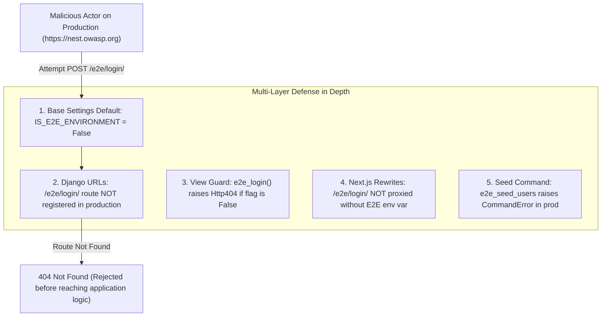

# Protected Routes & E2E Testing Architecture

This document explains in detail how end-to-end (E2E) testing works on authenticated/protected routes in OWASP Nest, how test users are seeded, how authentication is simulated ("bypassed") without GitHub OAuth, and a thorough security analysis of whether this represents a vulnerability.

---

## 1. System Architecture & Layers Involved

OWASP Nest is a decoupled full-stack application consisting of multiple distinct layers:

```mermaid
flowchart TD
    subgraph TestRunner ["1. Test Orchestration Layer"]
        PW["Playwright (e2e-tests container)"]
    end

    subgraph FrontendLayer ["2. Frontend Layer (Next.js - Port 3000)"]
        NextProxy["Next.js Route Middleware (src/proxy.ts)"]
        NextConfig["Next.js Rewrites (next.config.ts)"]
        NextAuth["NextAuth JWT Session Handler"]
    end

    subgraph BackendLayer ["3. Backend Layer (Django - Port 9000)"]
        Urls["URL Router (settings/urls.py)"]
        E2ELoginView["E2E Login View (apps/nest/api/internal/views/e2e_login.py)"]
        StrawberryGQL["Strawberry GraphQL (apps/nest/api/internal/...)"]
        DjangoAuth["Django Session Middleware & Authentication Engine"]
    end

    subgraph StorageLayer ["4. Persistence & Cache Layer"]
        Postgres[(PostgreSQL: Users, Roles, Programs)]
        Redis[(Redis: Active Django Sessions)]
    end

    PW -->|POST /e2e/login/| NextConfig
    NextConfig -->|Proxy /e2e/login/| E2ELoginView
    E2ELoginView -->|django.contrib.auth.login| DjangoAuth
    DjangoAuth -->|Store Session ID| Redis
    DjangoAuth -->|Query User| Postgres
    E2ELoginView -->>|Set-Cookie: nest.session-id| PW

    PW -->|POST /graphql/ with nest.session-id| NextConfig
    NextConfig -->|Proxy /graphql/| StrawberryGQL
    StrawberryGQL -->|Verify Session & Role| DjangoAuth
    StrawberryGQL -->|Fetch Data| Postgres
    StrawberryGQL -->>|200 OK + Data| PW
```

---

## 2. Real Production Auth vs. E2E Challenge

### Real Production Authentication Flow:
1. **User interaction:** User navigates to Nest and clicks *"Sign in with GitHub"*.
2. **OAuth Handshake:** `NextAuth` opens a GitHub OAuth popup $\rightarrow$ User inputs credentials $\rightarrow$ GitHub returns an OAuth `access_token`.
3. **Session Synchronization:** The frontend hook (`useDjangoSession`) executes the `githubAuth` GraphQL mutation, passing the GitHub `access_token` to Django.
4. **Backend Verification:** Django calls the GitHub API using that token to fetch verified email addresses and GitHub profile data.
5. **Django Session Creation:** Django finds or creates the `NestUser` in PostgreSQL and calls `django.contrib.auth.login(request, user)`.
6. **Cookie Delivery:** Django returns the session cookie: `nest.session-id`. Subsequent GraphQL requests send this cookie.

### Why Real Auth Fails in Automated CI/E2E:
* Playwright test runners in GitHub Actions cannot solve GitHub Captchas, handle 2FA/MFA, or safely store real GitHub user passwords.
* External OAuth providers enforce strict rate-limiting on CI IP addresses.
* Downloading production database dumps (`nest.dump`) is slow, requires AWS S3 secrets, and breaks foreign key relationships over time.

---

## 3. How Test Users Are Created

Test fixtures are created deterministically in PostgreSQL by a dedicated Django management command:

📁 `backend/src/apps/nest/management/commands/e2e_seed_users.py`

### Step-by-Step Execution:
1. **Environment Gate:** Checks `if not settings.IS_E2E_ENVIRONMENT: raise CommandError(...)`. The command aborts instantly if run in local, staging, or production mode.
2. **Search Indexing Disabled:** Wraps all database operations in `with index.disable_indexing():`. This stops Django signals from attempting to send test accounts to Algolia search.
3. **Entity Creation:**
   The command creates 3 deterministic test profiles:
   * **`e2e-user`**: Base user with no mentorship association.
   * **`e2e-mentor`**: GitHub User $\rightarrow$ Nest User $\rightarrow$ Linked `Mentor` row.
   * **`e2e-mentee`**: GitHub User $\rightarrow$ Nest User $\rightarrow$ Linked `Mentee` row.
4. **Idempotency:** Uses `objects.get_or_create(...)` with fallback defaults. If the containers restart or the command runs multiple times, existing records are reused without creating duplicates or raising unique constraint errors.

---

## 4. How the "Login Bypass" Works

Instead of faking OAuth tokens or mocking network requests inside the browser, the POC creates a legitimate, server-side authenticated session via a test-only entry point.

### Step 1: The Request
Playwright calls the helper `await loginAs(page, 'e2e-mentor')` in `e2e/helpers/loginAs.ts`. This sends:
```http
POST /e2e/login/ HTTP/1.1
Host: localhost:3000
Content-Type: application/json

{"username": "e2e-mentor"}
```

### Step 2: Next.js Rewrite Proxy
In `frontend/next.config.ts`, when running in E2E mode (`NEXT_PUBLIC_E2E_BACKEND_BASE_URL` is set):
```typescript
{ source: '/e2e/login/', destination: `${backendBase}/e2e/login/` }
```
Next.js proxies the request directly to Django on port 9000 without CORS friction.

### Step 3: Django Native Login
In `backend/src/apps/nest/api/internal/views/e2e_login.py`:
1. Validates that `settings.IS_E2E_ENVIRONMENT` is `True`.
2. Reads the `username` from the JSON body.
3. Loads the user from PostgreSQL: `user = User.objects.get(username=username)`.
4. Executes native Django login:
   ```python
   login(request, user)
   ```
5. Django's `SessionMiddleware` creates a new session in Redis and adds a `Set-Cookie` header in the HTTP response:
   ```http
   HTTP/1.1 200 OK
   Content-Type: application/json
   Set-Cookie: nest.session-id=s%3A...; Path=/; HttpOnly; SameSite=Lax

   {"ok": true, "username": "e2e-mentor"}
   ```

### Step 4: Playwright Context Capture
Playwright's `page.request` automatically synchronizes all `Set-Cookie` headers into the active `BrowserContext`. Any subsequent GraphQL request or page navigation made by Playwright carries the valid `nest.session-id` cookie.

### Step 5: Protected API Execution
When Playwright requests protected GraphQL operations (such as `query { myPrograms { ... } }`):
* The request arrives at Django with the `nest.session-id` cookie.
* Django's `AuthenticationMiddleware` reads the cookie, finds the session in Redis, and attaches `request.user = <NestUser: e2e-mentor>`.
* Strawberry GraphQL / Django permissions check `info.context.request.user.is_authenticated`, which returns `True`.
* The query returns the authorized mentorship data.

---

## 5. Security & Threat Analysis: Is This a Security Vulnerability?

### Short Answer:
**No.** It is a standard, industry-recognized test fixture pattern when gated properly by environment flags.

### Deep Threat Model:



### Risk Matrix:

| Potential Threat | Severity | Technical Control & Mitigation | Residual Risk |
| :--- | :---: | :--- | :---: |
| **Bypassing authentication in production** (e.g. logging into admin account) | 🔴 Critical (if exposed) | • `IS_E2E_ENVIRONMENT` is hardcoded to `False` in `settings/base.py` and only `True` in `settings/e2e.py`.<br>• `settings/urls.py` conditionally adds the URL: `if settings.IS_E2E_ENVIRONMENT: urlpatterns += [path("e2e/login/", e2e_login)]`. In production, the route does not exist.<br>• `e2e_login` view explicitly checks `if not settings.IS_E2E_ENVIRONMENT: raise Http404`. | 🟢 **None** |
| **CSRF exploitation** | 🟡 Medium | `@csrf_exempt` is attached only to `/e2e/login/`. Because the endpoint does not exist in production, CSRF cannot be exploited. | 🟢 **None** |
| **Production database poisoning** | 🟡 Medium | `e2e_seed_users` checks `IS_E2E_ENVIRONMENT` and raises `CommandError` outside the e2e environment. | 🟢 **None** |
| **Algolia search pollution** | 🟢 Low | `index.disable_indexing()` prevents fake test users from being pushed to Algolia search indices. | 🟢 **None** |

---

## 6. Current Scope vs. Future Expansion

| Feature Area | Current POC State | Future Enhancement |
| :--- | :--- | :--- |
| **Authenticated GraphQL Queries** | ✅ Fully tested via Django session (`nest.session-id`). | Expand test coverage to mutative operations (create program, apply as mentee). |
| **Unauthenticated Redirects** | ✅ Verified (`/my/mentorship` $\rightarrow$ `/auth/login`). | Add assertions for expired session handling. |
| **Authenticated UI Page Rendering** | ⚠️ Not included in this first cut. | To test `/my/mentorship` UI components in a browser, NextAuth JWT (`next-auth.session-token`) must also be generated/injected alongside the Django session cookie. |
| **Role Matrix Coverage** | ✅ Mentor & Mentee seeded. | Add `Project Leader` user seeding to test program creation permissions. |
